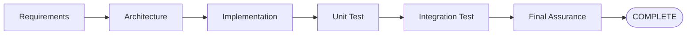
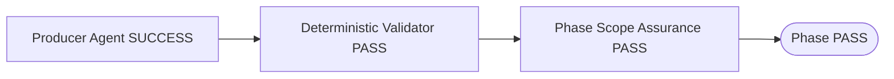
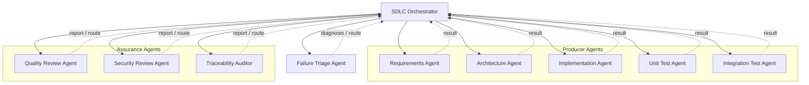
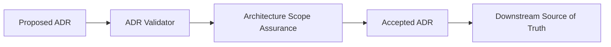
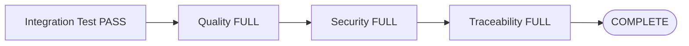
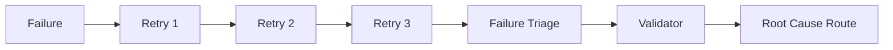

# AI SDLC Agent Framework

GitHub CopilotのCustom Agent / Skillを利用し、
RequirementsからArchitecture、Implementation、Unit Test、Integration Test、Final Assuranceまでを
一気通貫で実行するためのAI SDLC Frameworkです。

本Frameworkでは、各工程を担当する専門Agentと、
工程全体を制御するSDLC Orchestrator、
品質・Security・Traceabilityを独立監査するAssurance Agentを分離しています。

また、AIによる自己評価だけに依存せず、
機械的に判定可能な内容についてはDeterministic ValidatorをGateとして利用します。

---

## Overview

標準Lifecycleは以下です。



各Phaseは原則として以下の順序で進みます。



専門Agentが`SUCCESS`を返しただけでは、
工程全体のPASSとはみなしません。

---

## Architecture

Agent間の遷移はすべてSDLC Orchestratorが制御します。

Producer AgentやAssurance Agent同士が、
別Agentを直接起動することはありません。



---

## Agent Roles

| Agent | Role |
|---|---|
| SDLC Orchestrator | Agent起動、Phase遷移、Validator、Assurance、Routing、Invalidation、Final Assuranceを制御 |
| Requirements Agent | Requirementを定義・更新 |
| Architecture Agent | 重要なArchitecture DecisionをADRとして定義 |
| Implementation Agent | RequirementsとAccepted ADRに従ってProduction Codeを実装 |
| Unit Test Agent | Requirements / Accepted ADRからExpected Resultを導出しUnit Testを作成・実行 |
| Integration Test Agent | Integration BehaviorとExternal Test Caseを含むIntegration Testを作成・実行 |
| Quality Review Agent | SDLC成果物の意味的品質を独立レビュー |
| Security Review Agent | Security品質を独立監査 |
| Traceability Auditor | RequirementからTestまでのTraceabilityを監査 |
| Failure Triage Agent | 同一Root CauseのFailureが収束しない場合に原因と戻り先を診断 |

---

## Framework Components

本Frameworkでは、責務を以下のように分離しています。

| Component | Responsibility |
|---|---|
| Agent | **WHO**：誰が責務を持つか |
| Skill | **HOW**：具体的にどう作業するか |
| Template | **WHAT**：成果物をどの構造で作るか |
| Policy | PASS / FAIL条件、Severity、Routingなどの判定基準 |
| Criterion | AIが意味的に評価する個別観点 |
| Validator | 機械的に判定可能なGate |
| Orchestrator | Agent起動、工程遷移、差し戻し、再実行 |
| Report | Agent / ValidatorのRuntime結果 |

### Key Principles

- 専門Agentの`SUCCESS`だけではPhase PASSにしない
- Validatorが存在する工程ではValidator PASSを必須とする
- Assurance Agentは成果物を修正しない
- Agent間遷移は必ずSDLC Orchestratorを経由する
- 後工程の都合でRequirementやAccepted ADRを変更しない
- Test Expected ResultをProduction Codeから逆算しない
- 上流成果物変更後に古い後続PASSを再利用しない
- Runtime ReportをRequirementやADRのSource of Truthとして扱わない

---

## Architecture Decision Lifecycle

新しいADRはArchitecture Phaseで`Proposed`として作成されます。



Architecture PhaseのAssuranceでは、
Acceptance候補のProposed ADRを監査対象とします。

Architecture Phase完了後のImplementation以降では、
Accepted ADRのみを現在有効なArchitecture Decisionとして扱います。

---

## Assurance

Assurance Agentは、Producer Agentとは独立して成果物を監査します。

### Quality Review

主な観点:

- Requirement内部整合性
- Architecture妥当性
- Requirement / ADR / Implementation整合
- Scope Expansion
- 不必要なComplexity
- Unit Test / Integration Testの有効性
- Cross Phase Consistency

### Security Review

主な観点:

- Authentication / Authorization
- Secret / Credential
- Input Validation / Injection
- Data Protection
- Error / Logging
- Dependency / Configuration
- Security Test Coverage
- Cross Phase Security Consistency

Secretを検出しても、
Secret値そのものをReportへ出力してはいけません。

### Traceability Audit

以下のForward / Reverse Traceabilityを確認します。

```text
Requirement
  ↓
ADR
  ↓
Implementation
  ↓
Unit Test
  ↓
Integration Test
```

---

## Phase Scope Assurance and Final Assurance

各Phase完了時には、
現在までに存在するArtifactを対象としてPhase Scope Assuranceを実行します。

例:

```text
Architecture      → audit_scope=ARCHITECTURE
Implementation    → audit_scope=IMPLEMENTATION
Unit Test         → audit_scope=UNIT_TEST
Integration Test  → audit_scope=INTEGRATION_TEST
```

Integration Test Phase PASS後は、
SDLC全体を`audit_scope=FULL`で再監査します。



Phase単位のAssurance PASSを
Final Assurance PASSの代わりに利用してはいけません。

---

## Failure Routing

Failureは発生した工程ではなく、
Root Causeに基づいてRoutingします。

| Classification | Route |
|---|---|
| REQUIREMENT_ERROR | Requirements |
| ADR_REQUIRED | Architecture |
| IMPLEMENTATION_ERROR | Implementation |
| TEST_ERROR | Unit Test / Integration Test |
| ENVIRONMENT_ERROR | Environment / Orchestrator |
| TEST_SPEC_CONFLICT | User Decision |
| AUTOMATION_BLOCKED | User Decision |

たとえばIntegration TestでFAILしても、
原因がProduction CodeであればImplementationへ戻します。

---

## Failure Triage

通常Routingによる修正・再実行を行っても、
同一Root CauseのFailureが繰り返される場合はFailure Triageを実行します。

標準では同一Root Causeについて3回失敗した場合に起動します。



Failure Triageの主なResult:

- `TRIAGED`
- `BLOCKED`
- `INVALID_INVOCATION`

Failure Triage自身は成果物を修正しません。

---

## Integration Test and External Cases

Integration Testでは、
AI生成CaseとExternal Test Caseの独立性を維持します。

Case種別:

- `AI_GENERATED / INITIAL`
- `AI_GENERATED / GAP_FILL`
- `EXTERNAL`

AI INITIAL Caseは、
External Caseを確認する前に生成・固定します。

External Case確認後に、
AI INITIAL Caseを変更してはいけません。

External Caseが未配置の場合は、
AI自身の判断で「External Caseなし」として処理を継続せず、
ユーザーの明示的な選択を必要とします。

---

## Invalidation

上流Artifactが変更された場合、
変更前の後続PASSをそのまま利用しません。

| Changed Artifact | Re-validation |
|---|---|
| Requirements | Architecture以降 |
| Accepted ADR | Implementation以降 |
| Production Code | 影響するUnit Test / Integration Test |
| Unit Test Codeのみ | Unit Test |
| Integration Test Codeのみ | Integration Test |

Assurance対象Artifactが変更された場合は、
Quality / Security / Traceabilityの既存PASSも再利用せず再監査します。

---

## Repository Structure

```text
.
├── README.md
│
├── .github/
│   ├── copilot-instructions.md
│   │
│   ├── agents/
│   │   ├── orchestrator/
│   │   │   └── sdlc-orchestrator.agent.md
│   │   ├── ...
│   │   └── assurance/
│   │       ├── quality-review.agent.md
│   │       ├── security-review.agent.md
│   │       ├── traceability-auditor.agent.md
│   │       └── failure-triage.agent.md
│   │
│   └── skills/
│       ├── requirements/
│       ├── architecture/
│       ├── implementation/
│       ├── unit-test/
│       ├── integration-test/
│       ├── quality-review/
│       ├── security-review/
│       ├── traceability-audit/
│       └── failure-triage/
│
├── docs/
│   ├── requirements/
│   ├── adr/
│   └── ai-sdlc/
│       └── agent-framework-guide.md
│
├── external-tests/
│   └── integration-test/
│
└── reports/
    ├── unit-test/
    ├── integration-test/
    ├── quality-review/
    ├── security-review/
    ├── traceability/
    ├── failure-triage/
    └── sdlc/
```

---

## Where to Customize

変更したい内容に応じて、変更先を分けます。

| 変更したい内容 | 主な変更先 |
|---|---|
| Project全体の不変ルール | `.github/copilot-instructions.md` |
| SDLC順序 / Routing / Invalidation | `.github/agents/orchestrator/sdlc-orchestrator.agent.md` |
| Agentの責務・Input・Output | `.github/agents/**/<agent>.agent.md` |
| Agentの具体的な作業手順 | `.github/skills/<skill>/SKILL.md` |
| PASS / FAIL / Severity / Routing基準 | `.github/skills/<skill>/policy/` |
| Assuranceの意味的観点 | `.github/skills/<assurance-skill>/criteria/` |
| 機械的なGate | `.github/skills/<skill>/scripts/validate_*.py` |
| ValidatorのUnit Test | `.github/skills/<skill>/scripts/test_validate_*.py` |

Validatorへ意味的判断を移さず、
機械的に判定可能な内容だけをValidatorで確認してください。

---

## Getting Started

本Frameworkを利用するときは、
SDLC OrchestratorをSDLC全体のエントリポイントとして扱います。

Orchestratorが、

1. 対象Phaseの専門Agentを起動
2. Validatorを実行
3. 必要なAssuranceを実行
4. PASS時に次Phaseへ遷移
5. FAIL時にRoot Cause工程へRouting
6. 必要に応じて後続PhaseをInvalidate
7. Integration Test完了後にFinal Assuranceを実行
8. すべてのGateがPASSした場合のみ`COMPLETE`

という流れを制御します。

実際のAgent実行ルールは、
各Agent / Skill / Policyを参照してください。

---

## Documentation

Frameworkの詳細設計、
Agent間関係、
Failure Triage、
カスタマイズ方法、
新Agent追加方法、
Troubleshootingについては以下を参照してください。

```text
docs/ai-sdlc/agent-framework-guide.md
```

実行時のRuleのSource of Truthは、
READMEではなく以下です。

```text
.github/copilot-instructions.md
.github/agents/
.github/skills/
```

---

## Maintenance

Frameworkを変更した場合は、
関連するAgent / Skill / Policy / Criterion / Validatorだけでなく、
必要に応じて以下も更新してください。

```text
README.md
docs/ai-sdlc/agent-framework-guide.md
```

特に以下を変更した場合はDocumentation更新を推奨します。

- Agent追加・削除
- Phase追加・変更
- Routing変更
- Assurance観点変更
- Failure Triage Rule変更
- External Test Case Rule変更
- Final Assurance Rule変更

---

## Summary

```text
SDLC Orchestrator
  ├─ Producer Agents
  │    ├─ Requirements
  │    ├─ Architecture
  │    ├─ Implementation
  │    ├─ Unit Test
  │    └─ Integration Test
  │
  ├─ Assurance Agents
  │    ├─ Quality Review
  │    ├─ Security Review
  │    └─ Traceability Audit
  │
  └─ Failure Triage
```

本Frameworkは、

```text
Agent       = 責務
Skill       = 手順
Policy      = 判定基準
Criterion   = 意味的監査観点
Validator   = 決定論的Gate
Orchestrator= SDLC制御
```

として責務を分離し、
RequirementsからFinal AssuranceまでのAI SDLCを
一貫したGateとRouting Ruleのもとで実行することを目的としています。
