# AI SDLC Agent Framework Guide

## 1. このドキュメントの目的

本ドキュメントは、本Repositoryで利用するAI SDLC Agent Frameworkについて、
以下を理解・運用・カスタマイズできるようにするためのガイドです。

- 各Agentの役割
- Agent間の関係
- SDLC全体の動作
- Validator / Assurance / Policy / Criterionの位置づけ
- Failure時のRouting
- Failure Triageの役割
- Final Assuranceの考え方
- カスタマイズ時に変更すべき場所
- 新しいAgent / Criterion / Validatorの追加方法

詳細な実行ルールのSource of Truthは、
各Agent、Skill、Policy、Criterion、Validatorです。

このドキュメントはそれらを横断的に理解するための説明資料であり、
実行時のRuleそのものを置き換えるものではありません。

---

## 2. Frameworkの基本思想

本Frameworkでは責務を以下のように分離します。

| 要素 | 役割 |
| --- | --- |
| Agent | WHO：誰がその責務を持つか |
| Skill | HOW：具体的にどう作業するか |
| Template | WHAT：成果物をどの構造で作るか |
| Policy | PASS / FAIL条件やRouting Rule |
| Criterion | AIが意味的に確認する個別観点 |
| Validator | 機械的に判定可能なGate |
| Orchestrator | Agent起動、工程遷移、差し戻し、再実行を制御 |
| Report | Agent / ValidatorのRuntime結果 |

重要な原則は以下です。

1. 専門Agentの`SUCCESS`だけではPhase PASSとしない。
2. Validatorが存在する工程ではValidator PASSを必須とする。
3. Assurance Agentは成果物を修正しない。
4. 専門Agent同士は直接呼び出さない。
5. Agent間の遷移は必ずSDLC Orchestratorを経由する。
6. 後工程の都合でRequirementやAccepted ADRを勝手に変更しない。
7. 上流成果物が変わった場合は古い後続PASSを再利用しない。
8. Test Expected ResultをProduction Codeから逆算しない。

---

## 3. Agent全体構成

本Frameworkは大きく3種類のAgentで構成されます。

- Orchestrator
- Producer Agent
- Assurance / Diagnosis Agent

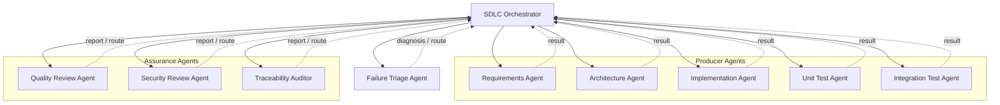

Producer AgentやAssurance Agentから別Agentへ直接遷移しません。

必ず、

```text
Agent
  ↓ Result
SDLC Orchestrator
  ↓ Route
Next Agent
```

という関係になります。

### 3.1 Agent間の親子関係（起動責務）

以下は、どのAgentがどのAgentを起動できるかを示す親子関係です。

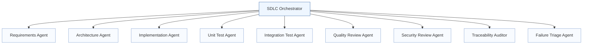

### 3.2 Agent呼び出し順序（標準フロー）

以下は、標準フローにおける呼び出し順序と、各AgentからOrchestratorへの結果返却順です。

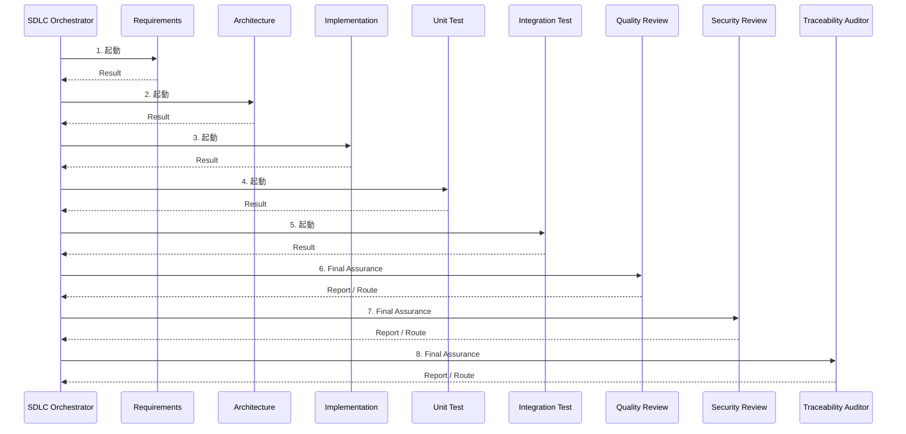

---

## 4. SDLC全体のLifecycle

標準Lifecycleは以下です。

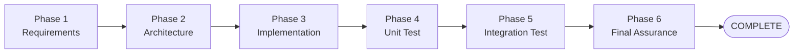

各Phaseは原則として以下のGateを通過します。

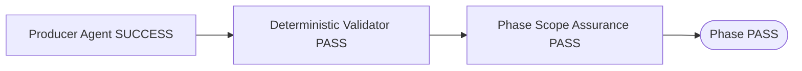

つまり、

```text
Agentが処理できた
```

ことと、

```text
工程として次へ進める
```

ことは別です。

---

## 5. 各Agentの役割

### 5.1 SDLC Orchestrator

#### 役割（SDLC Orchestrator）

SDLC全体の制御を担当します。

主な責務:

- 現在Phaseの管理
- Producer Agentの起動
- Validator実行
- Assurance Agentの起動
- Status確認
- Failure Classificationに基づくRouting
- 上流変更時のInvalidation
- Retry回数の管理
- Failure Triageの起動
- User Input Gateの制御
- Final Assurance
- COMPLETE判定

#### やらないこと

Orchestrator自身は以下を実施しません。

- Requirement作成・修正
- Architecture Decisionの設計
- Production Code実装
- Unit Test実装
- Integration Test実装

専門作業は必ず対象Agentへ委譲します。

---

### 5.2 Requirements Agent

#### 役割（Requirements Agent）

Requirementを定義・更新するProducer Agentです。

主な対象:

- Functional Requirement
- Non-Functional Requirement
- Acceptance Criteria
- Common Requirement
- Authentication / Authorization Requirement
- Error Requirement
- Data Model
- Constraint
- Out of Scope

#### ポイント（Requirements Agent）

後続工程の都合でRequirement IDやCanonical Structureを変更してはいけません。

Requirementに問題が見つかった場合は、
Requirements Phaseへ正式に差し戻して修正します。

---

### 5.3 Architecture Agent

#### 役割（Architecture Agent）

Requirementを満たすために必要な重要Architecture DecisionをADRとして定義します。

#### ADR Lifecycle

Architecture Phaseでは新規ADRをまず`Proposed`として作成します。

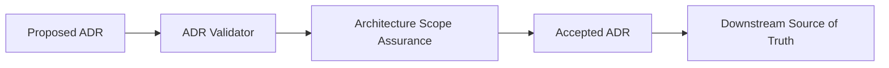

Architecture PhaseのAssuranceでは、
Acceptance候補となるProposed ADRを監査対象とします。

Architecture PhaseをPASSした後の後続工程では、
Accepted ADRのみを現在有効なArchitecture Decisionとして扱います。

#### ポイント（Architecture Agent）

重要な設計判断が不足している場合、
Implementation側で独自判断せず`ADR_REQUIRED`としてArchitectureへ戻します。

---

### 5.4 Implementation Agent

#### 役割（Implementation Agent）

RequirementsとAccepted ADRに従ってProduction Codeを実装します。

#### 主な責務

- Requirement実装
- Accepted ADR準拠
- Scope外実装の抑止
- Build / Compile / Lint / Type Check可能な状態の作成
- Test可能な構造の維持

#### 戻り先

重要なArchitecture Decisionが不足:

```text
ADR_REQUIRED
→ Architecture
```

Requirement自体に問題:

```text
REQUIREMENT_ERROR
→ Requirements
```

---

### 5.5 Unit Test Agent

#### 役割（Unit Test Agent）

RequirementsおよびAccepted ADRからExpected Resultを導出し、
Unit Testを作成・実行します。

#### 原則

Expected Resultを現在のProduction Codeから逆算してはいけません。

Production Codeに問題がある場合:

```text
IMPLEMENTATION_FIX_REQUIRED
→ Implementation
→ Unit Test再実行
```

Test Code自体の問題:

```text
TEST_ERROR
→ Unit Test
```

---

### 5.6 Integration Test Agent

#### 役割（Integration Test Agent）

複数Component / Dependency / Business Flowを跨ぐIntegration Behaviorを検証します。

本Frameworkでは、
外部から与えられるTest CaseをAI評価用データとして扱うため、
AI生成Caseとの独立性を重要視します。

#### Integration Test Caseの種類

- AI GENERATED / INITIAL
- AI GENERATED / GAP_FILL
- EXTERNAL

#### External Case Independence

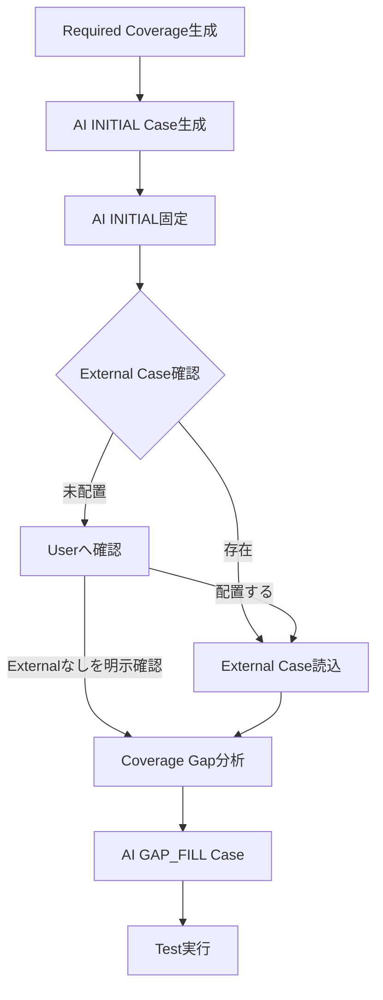

External Case確認後にAI INITIALを変更してはいけません。

External Caseが未配置の場合、
AI自身の判断で「External Caseなし」として進めることも禁止します。

---

## 6. Assurance Agents

Assurance AgentはProducer Agentとは異なり、
成果物を作るのではなく独立した監査を行います。

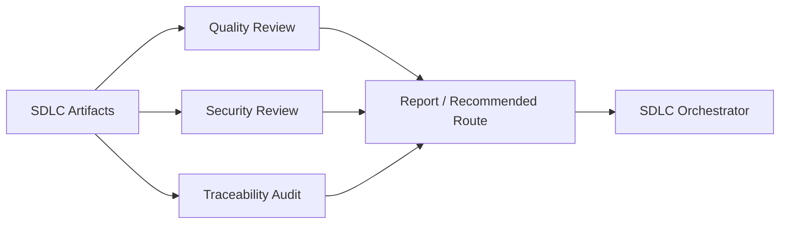

Assurance Agent自身が問題を修正してはいけません。

---

### 6.1 Quality Review Agent

#### 目的（Quality Review Agent）

構造Validatorでは判定できない意味的品質を確認します。

主な観点:

- Requirementの内部整合性
- Requirementと設計の整合
- Architectureの妥当性
- 実装の過不足
- Scope Expansion
- 不必要なComplexity
- Unit Testの有効性
- Integration Testの有効性
- Cross Phase Consistency

#### カスタマイズポイント（Quality Review Agent）

意味的品質観点を追加・変更したい場合は、
主に以下を変更します。

```text
.github/skills/quality-review/criteria/
.github/skills/quality-review/policy/quality-review-policy.yaml
```

機械判定ルールを変更する場合:

```text
.github/skills/quality-review/scripts/validate_quality_review.py
```

Validatorを変更した場合は、
対応するUnit Testも更新します。

---

### 6.2 Security Review Agent

#### 目的（Security Review Agent）

SDLC成果物をSecurity観点で独立監査します。

主な観点:

- Authentication
- Authorization
- Secret / Credential
- Input Validation
- Injection
- Data Protection
- Sensitive Data Exposure
- Error / Logging
- Dependency / Configuration
- Security Test Coverage
- Cross Phase Security Consistency

#### Secret取扱い

Secretを検出しても、
Secret値そのものをReportへ出してはいけません。

Evidenceには以下のような情報だけを記録します。

```text
File
Line / Symbol
Issue Type
Risk
```

#### カスタマイズポイント（Security Review Agent）

Semantic Security観点:

```text
.github/skills/security-review/criteria/
```

合否・Severity・Routing:

```text
.github/skills/security-review/policy/security-review-policy.yaml
```

Deterministic Check:

```text
.github/skills/security-review/scripts/validate_security_review.py
```

---

### 6.3 Traceability Auditor

#### 目的（Traceability Auditor）

以下の追跡可能性を監査します。

```text
Requirement
  ↓
ADR
  ↓
Implementation
  ↓
Unit Test
  ↓
Integration Test
```

主な確認内容:

- Forward Traceability
- Reverse Traceability
- Invalid Reference
- Orphan Artifact
- Missing Traceability
- Coverage Evidence
- Stale Evidence
- Cross Phase Conflict

#### Requirement IDを持たない項目

Project-wide Requirementなど、
IDがないRequirementへ新しいIDを勝手に付与してはいけません。

必要な場合は、

```text
docs/requirements/requirements.md#heading
```

のようなSource Referenceを使用します。

#### カスタマイズポイント（Traceability Auditor）

Traceability Rule:

```text
.github/skills/traceability-audit/policy/
```

監査手順:

```text
.github/skills/traceability-audit/SKILL.md
```

Deterministic Validation:

```text
.github/skills/traceability-audit/scripts/validate_traceability.py
```

---

## 7. Phase Scope AssuranceとFinal Assurance

Assuranceには2種類あります。

### Phase Scope Assurance

各Phase終了時点で、
現在までに存在するArtifactだけを対象に監査します。

例:

```text
Architecture完了
→ audit_scope=ARCHITECTURE

Implementation完了
→ audit_scope=IMPLEMENTATION

Unit Test完了
→ audit_scope=UNIT_TEST

Integration Test完了
→ audit_scope=INTEGRATION_TEST
```

Architecture Scopeだけは、
Acceptance候補のProposed ADRを監査対象として扱います。

Implementation以降ではAccepted ADRのみを有効なDecisionとして扱います。

### Final Assurance

Integration Test PhaseがPASSした後、
SDLC全体を`audit_scope=FULL`で再監査します。

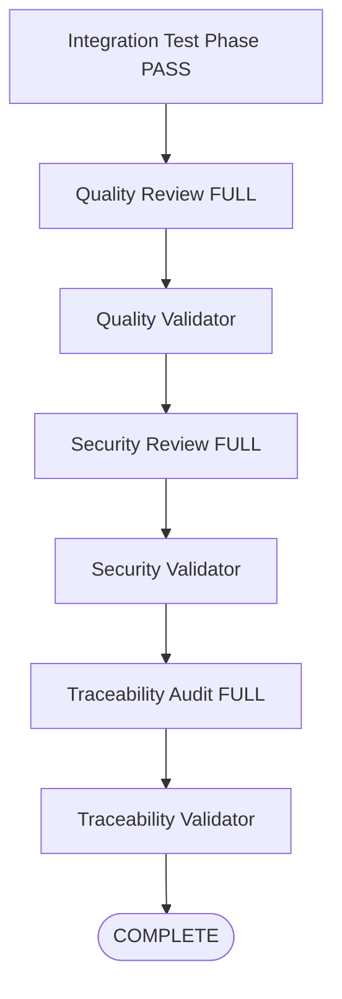

Phase単位のAssurance PASSを
Final Assurance PASSの代わりにしてはいけません。

Final Assuranceで上流修正が発生した場合は、
影響工程を再実行した後、Final Assuranceも再実行します。

---

## 8. Failure Routing

Failureを検出した場合、
発生箇所ではなくRoot Causeに基づいて戻り先を決定します。

| Classification | 基本Route |
| --- | --- |
| REQUIREMENT_ERROR | Requirements |
| ADR_REQUIRED | Architecture |
| IMPLEMENTATION_ERROR | Implementation |
| TEST_ERROR | Unit Test / Integration Test |
| ENVIRONMENT_ERROR | Environment / Orchestrator |
| TEST_SPEC_CONFLICT | User判断 |
| AUTOMATION_BLOCKED | User判断 |

例:

```text
Integration Test FAIL
    ↓
原因はProduction Code
    ↓
IMPLEMENTATION_ERROR
    ↓
Implementationへ戻る
```

TestがFAILしたからといって、
自動的にTest Agentへ戻すわけではありません。

---

## 9. Failure Triage Agent

### 目的（Failure Triage Agent）

通常のFailure Routingを繰り返しても
同一Root CauseのFailureが解消しない場合に、
修正Loopそのものを診断します。

Failure Triage自身は成果物を修正しません。

### 起動

標準では同一Root CauseのFailureについて
通常Routingによる修正・再実行が3回失敗した場合に起動します。

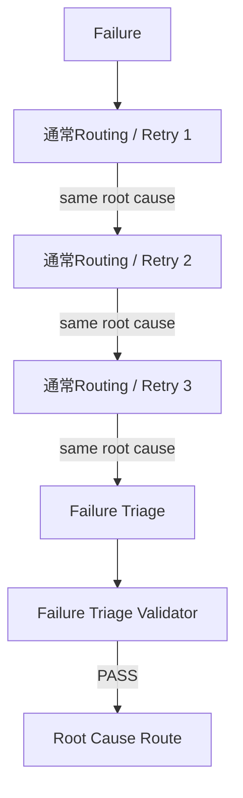

### 主なClassification

- REQUIREMENT_ERROR
- ADR_REQUIRED
- IMPLEMENTATION_ERROR
- TEST_ERROR
- ENVIRONMENT_ERROR
- CROSS_PHASE_CONFLICT
- UNKNOWN_ROOT_CAUSE

### Result

```text
TRIAGED
BLOCKED
INVALID_INVOCATION
```

`TRIAGED`ならrecommended_routeへ戻します。

`BLOCKED`なら同一修正Loopを停止します。

`INVALID_INVOCATION`なら通常Failure Routingへ戻ります。

### Failure Triage対象外

以下は3回Retryする前にUser Gateへ送ります。

- EXTERNAL_TEST_INPUT_REQUIRED
- TEST_SPEC_CONFLICT
- AUTOMATION_BLOCKED

---

## 10. Invalidation

上流Artifactが変わった場合、
変更前の後続PASSをそのまま利用してはいけません。

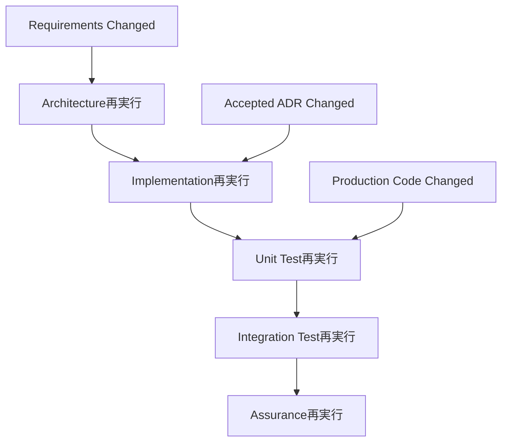

基本Rule:

| Changed Artifact | 再検証対象 |
| --- | --- |
| Requirements | Architecture以降 |
| Accepted ADR | Implementation以降 |
| Production Code | 影響するUnit / Integration Test |
| Unit Test Codeのみ | Unit Test |
| Integration Test Codeのみ | Integration Test |

Assurance対象Artifactが変更された場合は、
Quality / Security / Traceabilityの古いPASSも再利用しません。

---

## 11. Repository内の役割分担

推奨構造は以下です。

```text
.
├── .github/
│   ├── copilot-instructions.md
│   │
│   ├── agents/
│   │   ├── orchestrator/
│   │   │   └── sdlc-orchestrator.agent.md
│   │   ├── ...
│   │   └── assurance/
│   │       ├── quality-review.agent.md
│   │       ├── security-review.agent.md
│   │       ├── traceability-auditor.agent.md
│   │       └── failure-triage.agent.md
│   │
│   └── skills/
│       ├── requirements/
│       ├── architecture/
│       ├── implementation/
│       ├── unit-test/
│       ├── integration-test/
│       ├── quality-review/
│       │   ├── SKILL.md
│       │   ├── policy/
│       │   ├── criteria/
│       │   └── scripts/
│       ├── security-review/
│       │   ├── SKILL.md
│       │   ├── policy/
│       │   ├── criteria/
│       │   └── scripts/
│       ├── traceability-audit/
│       │   ├── SKILL.md
│       │   ├── policy/
│       │   └── scripts/
│       └── failure-triage/
│           ├── SKILL.md
│           ├── policy/
│           └── scripts/
│
├── docs/
│   ├── requirements/
│   ├── adr/
│   └── ai-sdlc/
│       └── agent-framework-guide.md
│
├── external-tests/
│   └── integration-test/
│
└── reports/
    ├── unit-test/
    ├── integration-test/
    ├── quality-review/
    ├── security-review/
    ├── traceability/
    ├── failure-triage/
    └── sdlc/
```

`reports/`はRuntime Resultです。

RequirementやADRの代わりとなるSource of Truthではありません。

---

## 12. どこを変更すればよいか

### Project全体の不変ルールを変えたい

変更先:

```text
.github/copilot-instructions.md
```

例:

- Agent間直接呼出し禁止
- Source of Truth
- Test Expected Result原則
- External Case不変
- Repository Independence

詳細な工程手順はここへ増やしすぎないでください。

### SDLCの工程順やRoutingを変えたい

変更先:

```text
.github/agents/orchestrator/sdlc-orchestrator.agent.md
```

例:

- Phase順序
- Agent起動タイミング
- Failure Routing
- Invalidation
- Final Assurance
- User Input Gate

### Agentの責務・境界を変えたい

変更先:

```text
.github/agents/**/<agent>.agent.md
```

例:

- Agentが扱うInput
- Output
- 禁止事項
- Parent Agent
- 実行可能Tool

### 作業手順を変えたい

変更先:

```text
.github/skills/<skill>/SKILL.md
```

例:

- 何をどの順番で読むか
- どのArtifactを確認するか
- Report生成手順

### PASS / FAIL条件を変えたい

変更先:

```text
.github/skills/<skill>/policy/*.yaml
```

Policyに置くもの:

- Allowed Scope
- Severity
- Blocking条件
- Routing
- Threshold
- Required Report
- Allowed Classification

### Assuranceの意味的観点を追加したい

変更先:

```text
.github/skills/<assurance-skill>/criteria/*.criterion.md
```

例:

Security Reviewへ新しいSecurity観点を追加する場合、
新しいCriterionを追加します。

Criterionで新しいIssue Classificationを使用する場合は、
Policy側のClassification / Routingも追加してください。

### 機械チェックを変えたい

変更先:

```text
.github/skills/<skill>/scripts/validate_*.py
```

Validatorは機械判定できる内容だけを扱います。

意味的判断をValidatorへ移してはいけません。

Validator変更時は、

```text
test_validate_*.py
```

も同時に更新してください。

---

## 13. カスタマイズ例

### 13.1 Quality Reviewへ新しい観点を追加

例:

「API backward compatibility」を新しい品質観点として追加したい場合。

1. `criteria/`へ新しいCriterionを追加
2. 必要ならPolicyへIssue Classificationを追加
3. RoutingをPolicyへ追加
4. ValidatorがReport構造上そのClassificationを許可できるか確認
5. Validator Testを追加
6. 本ドキュメントの観点一覧も更新

### 13.2 Security Severity Ruleを変更

変更対象:

```text
security-review-policy.yaml
```

例:

特定ClassificationをHIGH以上として扱いたい場合、
Policy / Criterionの責務を確認して変更します。

Validatorは、
ReportされたSeverityがPolicyに適合しているかを検証します。

### 13.3 Failure Triage Retry回数を変更

現在の標準は3回です。

変更する場合は、

```text
.github/skills/failure-triage/policy/failure-triage-policy.yaml
```

のRetry Thresholdを変更します。

また、OrchestratorにRetry回数が固定値として記述されている場合は、
Orchestrator側の記述も同時に同期してください。

将来的に一元化する場合は、
Orchestrator側を「Policyで指定されたRetry Threshold」と表現し、
Threshold値自体をPolicyへ集約する方式が適しています。

---

## 14. 新しいAgentを追加する場合

新Agentを追加する場合は、
Agent Fileを追加するだけでは完了しません。

標準手順:

1. Agentの責務を決める
2. Agent Fileを作成する
3. Skillを作成する
4. 必要ならTemplateを作成する
5. PASS / FAILがある場合はPolicyを作成する
6. Semantic ReviewならCriterionを作成する
7. Deterministic Gateが必要ならValidatorを作成する
8. Validator Testを作成する
9. SDLC Orchestratorの`agents:`へ登録する
10. 起動条件をOrchestratorへ追加する
11. Result Status / Routingを定義する
12. Invalidationへの影響を確認する
13. Completion Conditionsへの影響を確認する
14. 本ドキュメントを更新する

重要なのは、

```text
Agentを作った
```

だけでなく、

```text
Orchestratorからいつ呼ばれ、
何を返し、
その結果でどこへ遷移するか
```

まで定義することです。

---

## 15. やってはいけないカスタマイズ

以下はFrameworkの責務分離を壊すため避けてください。

### Producer Agentから次Agentを直接呼ぶ

悪い例:

```text
Implementation Agent
→ Unit Test Agentを直接起動
```

正しい例:

```text
Implementation Agent
→ Result
→ SDLC Orchestrator
→ Unit Test Agent
```

### Assurance Agentが成果物を修正する

悪い例:

```text
Security Review
→ 脆弱コードを直接修正
```

正しい例:

```text
Security Review
→ IMPLEMENTATION route
→ Orchestrator
→ Implementation Agent
```

### Validatorへ意味的レビューを入れる

悪い例:

```text
ValidatorがArchitectureとして美しいかAI判断する
```

Validatorは、

- 必須Field
- Status
- Count
- Coverage value
- Routing consistency
- Required Report
- Policy consistency

などの決定論的チェックを担当します。

### TestをProduction Codeへ合わせる

Expected ResultのSourceはRequirements / Accepted ADRです。

### External Test CaseをAI都合で変更する

External Caseは評価データです。

Input / Step / Expected Resultを変更してGateを通してはいけません。

### 上流変更後に古いPASSを使う

Requirement / ADR / Codeが変わった場合は、
Invalidation Ruleに従って再実行してください。

---

## 16. Troubleshooting

### Phaseが進まない

確認順:

1. Producer Agent Status
2. Validator exit code
3. Assurance Report
4. Assurance Validator
5. recommended_route
6. unresolved blocking issue
7. invalidated_phases

### 同じ修正を繰り返している

確認:

- Failure Signature
- Root Cause
- retry_count
- previous_routes
- Failure Triage起動条件

### Architectureから先へ進まない

確認:

- Proposed ADRが存在するか
- ADR Validator PASSか
- Architecture Scope Assurance PASSか
- Acceptance処理後にADRがAcceptedになっているか

### Integration Testで止まる

External Test Input Gateを確認します。

External Case未配置の場合、
ユーザーが以下のどちらかを明示する必要があります。

- External Caseを配置する
- External Caseなしで進める

### Final Assuranceで差し戻された

正常な動作です。

Root Cause工程へ戻し、
Invalidation Ruleに従って後続工程を再実行した後、
`audit_scope=FULL`のFinal Assuranceを再実行してください。

---

## 17. Framework変更時の確認チェックリスト

Frameworkを変更した場合は以下を確認してください。

- [ ] Project-wide invariantと矛盾していない
- [ ] Agentの責務境界が明確
- [ ] Agentが別Agentを直接起動していない
- [ ] SkillとAgentに同じ詳細手順を重複記載していない
- [ ] PolicyとValidatorの役割が分離されている
- [ ] Semantic判断をValidatorへ入れていない
- [ ] 新StatusのRoutingがOrchestratorに存在する
- [ ] 新Routeに必要なInvalidationが定義されている
- [ ] Validator変更に対応するUnit Testがある
- [ ] Architecture ScopeのProposed ADR例外が壊れていない
- [ ] Implementation以降はAccepted ADRだけを利用している
- [ ] External Case Independenceが維持されている
- [ ] Final Assuranceが`FULL`で実行される
- [ ] Failure Triage対象外FailureをRetryしていない
- [ ] Runtime ReportをSource of Truth化していない
- [ ] Repository / CI/CD / Cloud Providerを暗黙的に固定していない

---

## 18. まとめ

本Frameworkの中心となる考え方は、

```text
Orchestrator = 制御
Producer Agent = 成果物作成
Assurance Agent = 独立監査
Failure Triage = 非収束Failureの診断
Validator = 決定論的Gate
Policy = 合否・Routing基準
Criterion = 意味的監査観点
```

という責務分離です。

通常フロー:

```text
Requirements
→ Architecture
→ Implementation
→ Unit Test
→ Integration Test
→ Final Assurance
→ COMPLETE
```

各Phase:

```text
Producer Agent
→ Validator
→ Phase Scope Assurance
→ Phase PASS
```

Failure時:

```text
Failure
→ Root Cause Routing
→ 修正
→ 再実行
```

非収束時:

```text
同一Root Cause Retry Threshold到達
→ Failure Triage
→ Validator
→ Root Cause工程へ再Routing
```

最終的に、
すべての工程、Validator、Final AssuranceがPASSし、
未解決Blocking Issueが存在しない場合のみ
SDLC全体をCOMPLETEとします。
